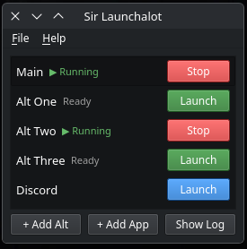

# Sir Launchalot

A C++/Qt6 application for running multiple Guild Wars 2 accounts simultaneously on Linux. Requires a Lutris GW2 installation. Distributed as an AppImage.

## AI Notice

This addon has been 100% created in [Windsurf](https://windsurf.com/) using Claude. I understand that some folks have a moral, financial or political objection to creating software using an LLM. I just wanted to make a useful tool for the GW2 community, and this was the only way I could do it.

If an LLM creating software upsets you, then perhaps this repo isn't for you. Move on, and enjoy your day.

## Screenshot



## Features

- **Lutris integration** — auto-detects your Lutris GW2 installation and launches main via Lutris
- **Automatic credential capture** — Setup Wizard walks you through logging in as each alt
- **Per-account addon toggle** — enable or disable addons (ArcDPS, ReShade, etc.) per alt
- **Graphics settings persistence** — each alt remembers its own graphics settings between sessions
- **Patch detection** — detects when GW2 updates and prompts to update alt credentials
- **External app launcher** — launch companion apps (Discord, TeamSpeak, etc.) from the same UI
- **Instance monitoring** — track running accounts with start/stop controls
- Runs on any Linux distro via AppImage

## How It Works

GW2 uses a mutex to prevent multiple instances. On Linux under Wine, each WINEPREFIX has its own mutex, so separate prefixes allow simultaneous launches.

Sir Launchalot clones your base Lutris GW2 prefix via **rsync** for each alt account, sharing the large `Gw2.dat` file via symlink. The `-shareArchive` flag ensures `Gw2.dat` is opened in shared mode. Each alt gets its own credentials (`Local.dat`) and graphics settings, captured automatically.

## Requirements

- A working GW2 installation managed by **Lutris**
- `rsync` (installed by default on most distros)

## Running (AppImage)

Download the latest `Sir_Launchalot-x86_64.AppImage` from Releases, then:

```bash
chmod +x Sir_Launchalot-x86_64.AppImage
./Sir_Launchalot-x86_64.AppImage
```

On first launch, the Setup Wizard will auto-detect your Lutris GW2 installation and create your main account.

## Building from Source

### Quick build (binary only)

```bash
mkdir build && cd build
cmake .. -DCMAKE_BUILD_TYPE=Release
make -j$(nproc)
```

### Build AppImage

Requires `curl` for downloading linuxdeploy (cached after first run):

```bash
./scripts/build-appimage.sh
```

The AppImage will be created at `build/Sir_Launchalot-x86_64.AppImage`.

### Build Dependencies

- CMake 3.16+
- Qt6 (Core, Gui, Widgets)
- A C++17 compiler

## License

This project is licensed under the [GNU General Public License v3.0](LICENSE).

This software is provided as-is, without a warranty of any kind. Use at your own risk. It might delete your files, melt your PC, burn your house down, or cause world peace. Probably not that last one, but we can hope.